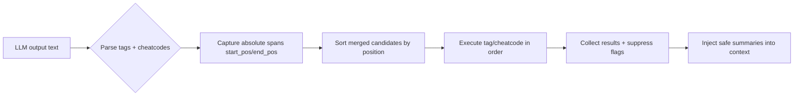

# CaptainHook 🪝

> Cheatcode-style extensibility for Python - like Busy38

## Installation

```bash
pip install captainhook
```

## Quick Start

```python
import captainhook

# Register a cheatcode
@captainhook.register("browser:navigate")
def navigate(url):
    print(f"Navigating to {url}")
    return {"status": "success", "url": url}

# Execute
result = captainhook.execute("[browser:navigate https://example.com /]")
```

## Tag Types

CaptainHook supports both **singles** and **doubles** (like XML):

### Singles (Self-Closing)
```python
[action /]                    # Simple tag
[namespace:action params /]   # Cheatcode with params
[next /]                      # Control flow
```

### Doubles (Container)
```python
[mission]Spawn sub-agent[/mission]
[tool]Execute code[/tool]
[echo]Content to process[/echo]
```

## Edge-Case Semantics (use with LLM-produced control streams)

CaptainHook and Busy38 are execution libraries, so malformed or adversarial tag output is a core threat model. The intent is to keep the library safe by default:

- **Deterministic ordering:** every executable token should be emitted and executed in source order.
- **Scope safety:** payloads that are meant to be data should not accidentally become executable instructions.
- **Loop control:** `[next /]` and no-response policies must remain explicit and bounded.
- **API compatibility transparency:** Busy38-style bridge helpers (namespace metadata, hook hooks) stay consistent with local registration behavior.

The QA document for these findings lives in the Busy38 internals:

- `busy-38-ongoing/docs/internal/TAG_ASSESSMENT_QA.md`

### Parser and execution order

Use source-order merge to avoid reordering mixed streams (`[tag]...[/tag]`, `[ns:action /]`, `[next /]`) that can alter behavior when merged naively.



### Nested payload safety (content vs control)

A common edge case is control-like text inside container payloads, e.g.:

```text
[mission]Draft this from data containing [agent_tools:run ... /][/mission]
```

Busy38 and CaptainHook should treat this according to explicit policy:

- by default, container payload is treated as protected content, not automatically executable.
- if policy allows execution, it should be explicitly documented and tested.

```mermaid
flowchart TD
  A[LLM payload text] --> B{Container parse}
  B -->|closed container found| C{Scope policy}
  C -->|strict(default)| D[Capture as data]
  C -->|explicit opt-in| E[Allow control extraction]
  D --> F[No tool execution]
  E --> G[Execute per registry checks]
```

### Continuation and no-response policy

`[next /]` is a continuation signal, while no-response metadata is a suppression signal for orchestration output.

```mermaid
flowchart TD
  A[Tool result emitted] --> B{no_response tag or metadata?}
  B -->|yes| C[Run action]
  C --> D[Do not append to follow-up context]
  B -->|no| E[Run action]
  E --> F[Append tool summary to context]
  D --> G[Loop decision from explicit [next /]]
  F --> G
```

### Hook lifecycle compatibility

## Examples

### Basic Usage

```python
import captainhook

# Self-closing tag
@captainhook.register("hello")
def hello():
    return "Hello, World!"

result = captainhook.execute("[hello /]")

# Cheatcode with parameters
@captainhook.register("math:add")
def add(a, b):
    return int(a) + int(b)

result = captainhook.execute("[math:add 5 3 /]")

# Container tag
@captainhook.register_container("echo")
def echo(content):
    return f"ECHO: {content}"

result = captainhook.execute("[echo]Hello World[/echo]")
```

### Context-Based Execution

```python
import captainhook

# Create isolated context
ctx = captainhook.Context()

@ctx.register("math:add")
def add(a, b):
    return int(a) + int(b)

@ctx.register_container("code")
def run_code(code):
    return eval(code)

# Execute multiple tags
text = """
[math:add 10 20 /]
[code]2 + 2[/code]
"""
results = ctx.execute_text(text)
```

### Async Support

```python
import captainhook
import asyncio

@captainhook.register("fetch:data")
async def fetch_data(url):
    import aiohttp
    async with aiohttp.ClientSession() as session:
        async with session.get(url) as response:
            return await response.text()

# Async execution
result = await captainhook.execute_async("[fetch:data https://api.example.com /]")
```

### Async Tool Loops and `noResponse`

Busy-like inference loops can emit multiple tags and control iteration with `[next /]`.

When registering namespace handlers, you can flag actions that should not force
automatic follow-up agent responses. This is useful for fire-and-forget tool work.

```python
import captainhook


class AgentTools:
    def execute(self, action, **kwargs):
        if action == "fire_and_forget":
            return {"status": "queued", "payload": kwargs}
        if action == "compute":
            return {"status": "done", "payload": kwargs}
        raise ValueError(f"Unknown action: {action}")


captainhook.register_namespace(
    "agent_tools",
    AgentTools(),
    metadata={
        "noResponse": False,
        "actions": {
            "compute": {"noResponse": False},
            "fire_and_forget": {"noResponse": True},
        },
    },
)

result = captainhook.execute("[agent_tools:compute x=1 /]")
print(captainhook.get_no_response("agent_tools", "compute"))  # False

result = captainhook.execute("[agent_tools:fire_and_forget x=1 /]")
print(captainhook.get_no_response("agent_tools", "fire_and_forget"))  # True
```

Use `get_no_response(namespace, action)` as a cue filter before appending tool output
back into the model context.

### Hooks and Filters

```python
import captainhook

ctx = captainhook.Context()

# Add hooks
ctx.hooks.add_action("before_execute", lambda tag: print(f"Before: {tag}"))
ctx.hooks.add_action("after_execute", lambda tag, result: print(f"After: {result}"))

# Add filters
ctx.filters.add_filter("result", lambda r: r.upper())

@ctx.register("echo")
def echo():
    return "hello"

result = ctx.execute("[echo /]")  # Returns "HELLO"
```

## Busy38-compatible SDK API

CaptainHook includes a compatibility layer so external systems can use Busy-style
hook and namespace-extension APIs without depending on the full Busy runtime.

```python
from captainhook import (
    on_pre_cheatcode_execute,
    on_post_cheatcode_execute,
    HookPoints,
    busy38_hooks,
    register_namespace,
    execute_cheatcode,
)


@on_pre_cheatcode_execute
def pre_hook(namespace, action, attrs, context=None):
    print("pre", namespace, action, attrs)


class DemoHandler:
    def execute(self, action, **kwargs):
        return {"action": action, "kwargs": kwargs}


register_namespace("demo", DemoHandler())
result = execute_cheatcode("demo", "status", {"mode": "active"})
print(result)

print(HookPoints.PRE_CHEATCODE_EXECUTE)
print("registry", busy38_hooks.list_hooks())
```

### Hook lifecycle and ID-style compatibility note

CaptainHook exposes two hook styles:

1. **Context hooks** (`Context.hooks`, `Context.filters`) for in-process registration.
2. **Busy38 bridge hooks** (`busy38_hooks`) for orchestrator-style compatibility.

When you mix extension styles, keep one policy:

- If you need deterministic removal in long-lived systems, use the same ID return/removal strategy everywhere you rely on it.
- If you depend on callback-only removal, document that scope and avoid passing IDs across boundary calls.

```mermaid
flowchart LR
  A[register()] --> B{Path}
  B -->|local context| C[Context.hooks / Context.filters]
  B -->|bridge compatibility| D[busy38_hooks API]
  C --> E[Execute handler]
  D --> E
  E --> F[remove_action/remove_filter by contract]
```

### Suggested guardrails for library consumers

For production systems using CaptainHook as an execution layer, we recommend:

- Keep parser behavior deterministic at boundary.
- Keep scope policy explicit for container contents.
- Keep loop controls explicit and monitored (`[next /]` and no-response decisions).
- Treat unknown tags as inert unless explicitly registered.
- Keep malformed markup fail-closed.

## Flask Integration

```python
from flask import Flask, request, jsonify
import captainhook

app = Flask(__name__)

@captainhook.register("browser:navigate")
def navigate(url):
    return {"action": "navigate", "url": url}

@app.route("/execute", methods=["POST"])
def execute():
    data = request.get_json()
    tag = data.get("tag")
    result = captainhook.execute(tag)
    return jsonify({"result": result})
```

## Testing

```bash
cd tests
pytest -v
```

## AI-Generated / Automated Contributions

Automated and AI-assisted contributions are welcome, provided they meet the same production standards as human-written code.

For production code, placeholders are not acceptable.

- Unit tests may use mocks and stubs.
- Runtime code must be functional and complete before merge.
- New functionality must include unit tests (or updates to existing tests) that cover the new behavior.
- Failure states are telemetry and should remain visible; do not introduce graceful-fallback behavior that hides runtime failures.
- Do not merge substantial architectural changes without a tracked issue number or an associated public forum thread.
- All relevant tests must pass before merge.

Before submitting generated changes, verify:

- No production file contains temporary placeholders (`TODO`, `FIXME`, `NotImplementedError`, `return None` placeholders).
- Mock/stub logic is limited to tests and test fixtures.
- Edge cases and failure paths are explicit, not hidden behind placeholders.

## License

GPL-3.0-only
