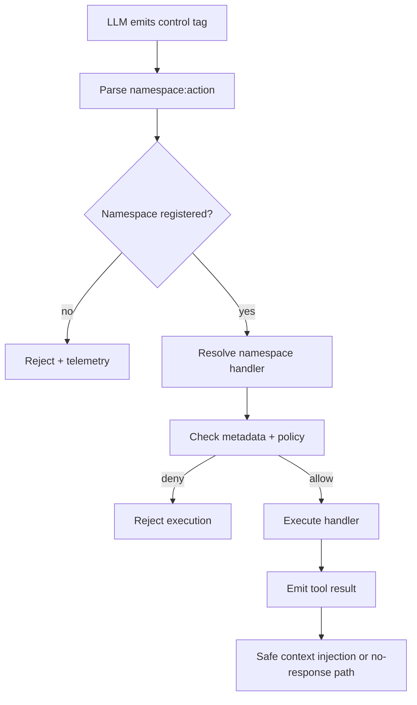
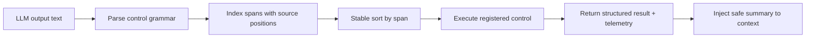
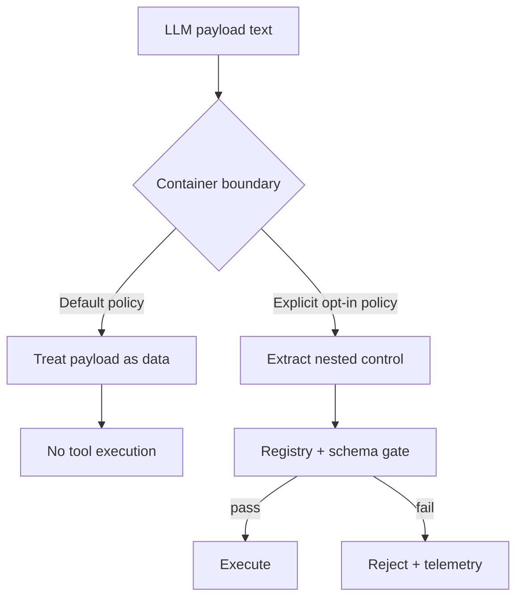
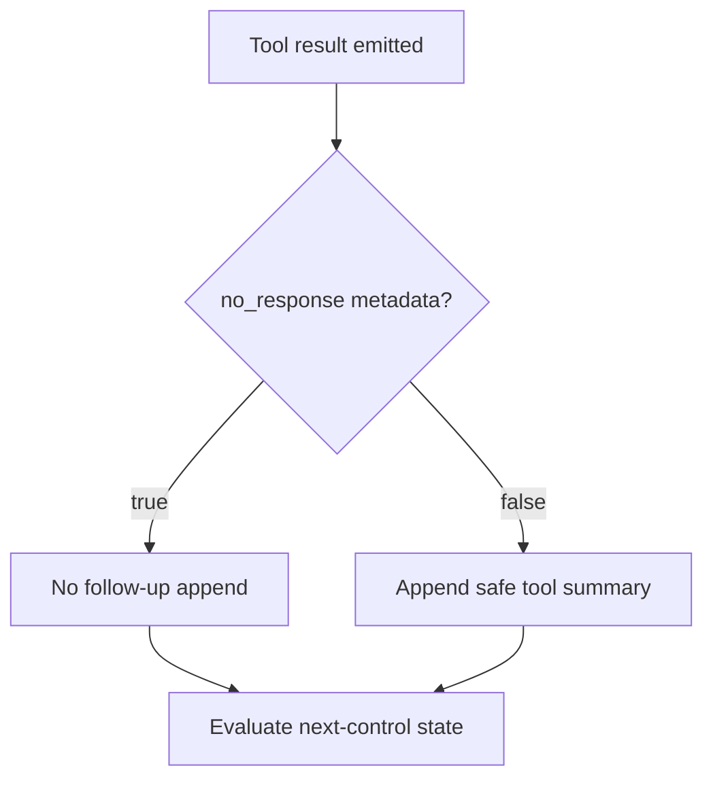
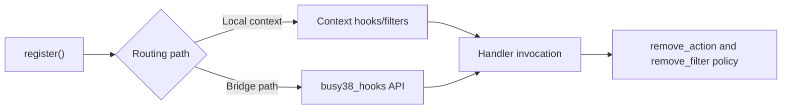

# CaptainHook: Deterministic Agentic Control Primitives for Python

CaptainHook is a minimal runtime layer for **agentic control execution**: parse structured tags, dispatch to registered handlers, and return bounded machine-readable artifacts for a model loop.

It is engineered around one hard rule:

> Control must be explicit, namespaced, ordered, and fail-closed.

That makes it suitable as an execution substrate for local inference loops, orchestrators, and tool-rich agents.

---

## Why this architecture (and why not plain JSON/Jinja)

Agent systems do not fail because they cannot call tools.
They fail when control streams become ambiguous, unordered, or implicitly executable.

CaptainHook avoids that class of failure with a constrained control grammar and
deterministic dispatch model.

- **JSON is data-first** and often lacks explicit temporal execution semantics.
- **Jinja templates drift into behavior by interpolation**, which makes source-of-truth intent hard to audit.
- **Tag-based control gives explicit intent and boundaries** in the same text channel where the model is already speaking.

The result is a control-plane that is:

1. **Low-friction to author** (small syntax surface)
2. **Easy to gate** (registries and metadata)
3. **Hard to mis-execute** (fail-closed parsing and explicit policies)

---

## Installation

```bash
pip install captainhook
```

---

## 1) Language and control primitives

CaptainHook supports two tag shapes.

### Single/self-closing tags

```text
[action /]
[namespace:action key="value" /]
[next /]
```

### Container tags

```text
[mission]Spawn sub-agent[/mission]
[tool]Execute code[/tool]
[echo]Content to process[/echo]
```

- **`[next /]`** is the loop continuation control signal.
- Containers are only executable when explicitly configured.

---

## 2) Why namespace registration is the key integration primitive

Most inference integrations fail because one system binds every action as global.
CaptainHook uses namespace scoping to make tool wiring explicit and composable:

- `namespace:action` prevents accidental collisions.
- Different providers can use identical action names in separate namespaces.
- Runtime routing and security policy are enforced at namespace boundaries.
- Tool registries become discoverable by capability surface (`agent_tools`, `browser`, etc.).

For inference backends this matters because namespaces become the **semantic bus**
that connects:

- vendor transports,
- orchestration loops,
- skill registries,
- and policy engines.



---

## 3) Execution semantics and safety contract

CaptainHook and Busy-style orchestration share the same operational threat model:

- malformed tags in model output,
- injected pseudo-tags in payload content,
- ambiguous nested control structures,
- loop churn via repeated continuation signals.

### Core guarantees

- **Source-order execution**: parse, sort by text position, then execute.
- **Scope-safe default**: container payloads are data unless policy says otherwise.
- **Fail-closed grammar**: parse failures stop execution.
- **Explicit loop control**: continuation and response suppression are separate signals.
- **Registry-only execution**: unknown namespaces/actions are inert.



### Nested payload safety (content vs control)

Example risk pattern:

```text
[mission]Draft this from data containing [agent_tools:run ... /][/mission]
```

Container payload policy:

- **Default:** treat as non-executable content.
- **Opt-in:** explicitly allow extraction and execution inside container content.
- **Always:** document policy and test both branches.



### Continuation and `no-response` control

`[next /]` is a loop-continue control.
`noResponse` is a suppression signal that stops automatic follow-up context injection.



---

## 4) Busy-compatibility surface

CaptainHook exposes a bridge API so Busy-style orchestration can reuse namespace and hook contracts.
The intent is compatibility without forcing full runtime coupling.

### Compatibility principles

- Same action lifecycle semantics where practical.
- Explicit metadata contracts (`noResponse`, namespace/action registration).
- Clear boundary between in-process context hooks and orchestrator-facing hooks.
- Deterministic removal/removal-scope policy made explicit in system docs.



---

## 5) Reference usage

### Basic registration

```python
import captainhook

# Register a handler
@captainhook.register("browser:navigate")
def navigate(url):
    print(f"Navigating to {url}")
    return {"status": "success", "url": url}

result = captainhook.execute("[browser:navigate https://example.com /]")
```

### Namespaced tools with no-response hints

```python
import captainhook


class AgentTools:
    def execute(self, action, **kwargs):
        if action == "fire_and_forget":
            return {"status": "queued", "payload": kwargs}
        if action == "compute":
            return {"status": "done", "payload": kwargs}
        raise ValueError(f"Unknown action: {action}")


captainhook.register_namespace(
    "agent_tools",
    AgentTools(),
    metadata={
        "noResponse": False,
        "actions": {
            "compute": {"noResponse": False},
            "fire_and_forget": {"noResponse": True},
        },
    },
)

captainhook.execute("[agent_tools:compute x=1 /]")
captainhook.execute("[agent_tools:fire_and_forget x=1 /]")
```

Use `get_no_response(namespace, action)` before adding tool output back into the model context.

### Context-local runtime and container handlers

```python
import captainhook

ctx = captainhook.Context()

@ctx.register("math:add")
def add(a, b):
    return int(a) + int(b)

@ctx.register_container("code")
def run_code(code):
    return eval(code)

text = """
[math:add 10 20 /]
[code]2 + 2[/code]
"""
results = ctx.execute_text(text)
```

### Async execution

```python
import captainhook
import asyncio

@captainhook.register("fetch:data")
async def fetch_data(url):
    import aiohttp
    async with aiohttp.ClientSession() as session:
        async with session.get(url) as response:
            return await response.text()

result = await captainhook.execute_async("[fetch:data https://api.example.com /]")
```

### Hooks and filters

```python
import captainhook

ctx = captainhook.Context()
ctx.hooks.add_action("before_execute", lambda tag: print(f"Before: {tag}"))
ctx.hooks.add_action("after_execute", lambda tag, result: print(f"After: {result}"))
ctx.filters.add_filter("result", lambda r: r.upper())

@ctx.register("echo")
def echo():
    return "hello"

ctx.execute("[echo /]")
```

### Busy38 compatibility API

```python
from captainhook import (
    on_pre_cheatcode_execute,
    on_post_cheatcode_execute,
    HookPoints,
    busy38_hooks,
    register_namespace,
    execute_cheatcode,
)

@on_pre_cheatcode_execute
def pre_hook(namespace, action, attrs, context=None):
    print("pre", namespace, action, attrs)

class DemoHandler:
    def execute(self, action, **kwargs):
        return {"action": action, "kwargs": kwargs}

register_namespace("demo", DemoHandler())
result = execute_cheatcode("demo", "status", {"mode": "active"})
print(result)
print(HookPoints.PRE_CHEATCODE_EXECUTE)
print("registry", busy38_hooks.list_hooks())
```

### Flask execution endpoint

```python
from flask import Flask, request, jsonify
import captainhook

app = Flask(__name__)

@captainhook.register("browser:navigate")
def navigate(url):
    return {"action": "navigate", "url": url}

@app.route("/execute", methods=["POST"])
def execute():
    data = request.get_json()
    tag = data.get("tag")
    result = captainhook.execute(tag)
    return jsonify({"result": result})
```

---

## 6) Suggested guardrails for production use

- Enforce deterministic parsing order for every loop cycle.
- Keep container policy explicit and versioned.
- Treat unknown namespaces/actions as inert.
- Bound loop and continuation behavior (`[next /]`).
- Keep malformed markup fail-closed.
- Preserve telemetry visibility for every parse/execute decision.

This approach is not about adding abstraction.
It is about making agent control behavior *auditable and hard to break*.

---

## 7) QA and testing

Tag safety assessment and findings are tracked here:

- `docs/internal/TAG_ASSESSMENT_QA.md`

Run local tests:

```bash
cd tests
pytest -v
```

---

## Contribution and review policy

Automated and AI-assisted contributions are welcome, provided they meet the same
production standards as human-written code.

For production code, placeholders are not acceptable.

- Unit tests may use mocks and stubs.
- Runtime code must be functional and complete before merge.
- New functionality must include unit tests (or updates to existing tests) that cover the new behavior.
- Failure states are telemetry and should remain visible; do not introduce graceful-fallback behavior that hides runtime failures.
- Do not merge substantial architectural changes without a tracked issue number or an associated public forum thread.
- All relevant tests must pass before merge.

Before submitting generated changes, verify:

- No production file contains temporary placeholders (`TODO`, `FIXME`, `NotImplementedError`, `return None` placeholders).
- Mock/stub logic is limited to tests and test fixtures.
- Edge cases and failure paths are explicit, not hidden behind placeholders.

## License

GPL-3.0-only
