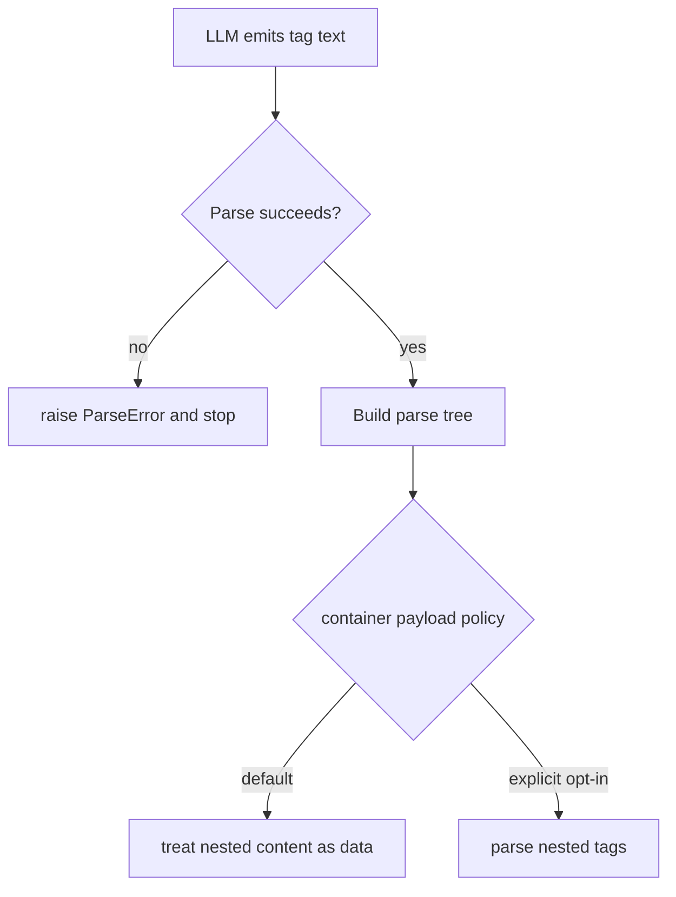
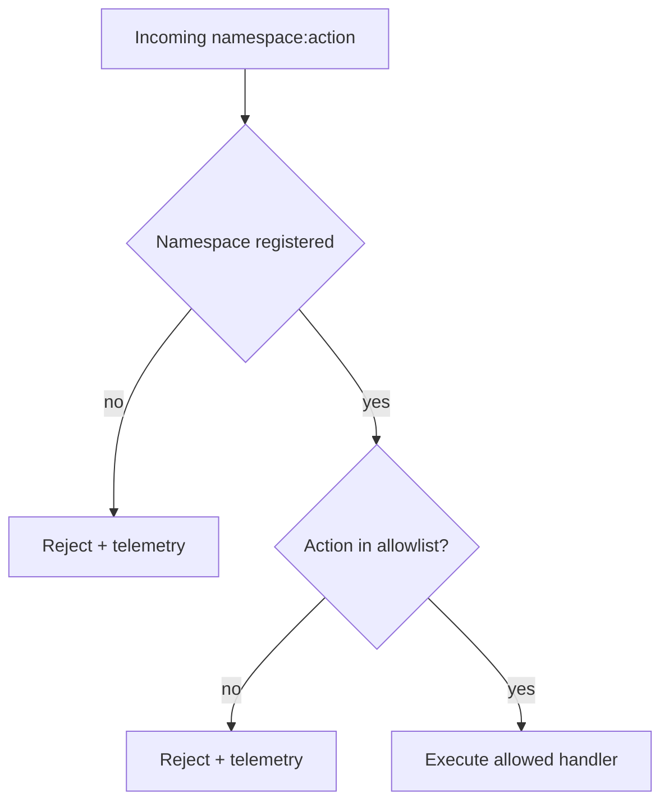

# CaptainHook Tag Assessment QA

## Scope

This assessment covers CaptainHook’s tag execution path, namespace registry, and BusyBridge hook lifecycle from the perspective of prompt-injection safety, parser determinism, and governance integrity.

## Findings addressed

### 1) Parsing safety (critical)

Risk:
- Regex-driven parsers can be fragile under malformed input and can mis-handle nested tags.

Mitigation implemented:
- `parse_all()` now uses a deterministic stack parser.
- Malformed control markup raises `ParseError`.
- Unknown or unbalanced tags are rejected instead of being silently ignored.

### 2) Parser behavior and container policy (critical)

Risk:
- Container content can contain control-like strings that should not execute by default.

Mitigation implemented:
- Nested tags inside container payload are only parsed when explicitly requested (`include_nested=True`).
- `execute`/`execute_text` default behavior captures container payload as data.

### 3) Namespace/action control (high)

Risk:
- A permissive namespace can expose unintended actions.

Mitigation implemented:
- Registry metadata supports `allowed_actions`.
- Disallowed actions are rejected before handler execution.

### 4) Parameter tampering between tag attrs and runtime context (high)

Risk:
- Runtime kwargs can overwrite LLM-provided attrs.

Mitigation implemented:
- `_merge_call_kwargs` rejects overlapping keys.
- Execution kwargs are passed through immutable mappings.

### 5) Security hook immutability (critical)

Risk:
- Removing critical pre/post cheatcode hooks could bypass governance.

Mitigation implemented:
- Critical hooks (`busy38.pre_cheatcode_execute`, `busy38.post_cheatcode_execute`) require
  `allow_critical=True` and a matching `CAPTAINHOOK_HOOK_REMOVAL_TOKEN`.
- Hook/filter callbacks execute in isolated `try/except` blocks with immutable copies.

### 6) Failure semantics

Risk:
- Silent failures can hide unsafe behavior.

Mitigation implemented:
- Parse/lookup failures are surfaced as explicit errors in parser and namespace execution paths.
- The registry now fails closed on invalid namespace/action inputs.

## Remaining risks

- Filters are still supported as opt-in extensions and can be used only when explicitly configured.
- Long-lived plugin ecosystems should continue to treat plugin-installed namespaces as trusted input channels.
- Full hash-chain tamper evidence is not yet implemented in this stage; this remains a roadmap follow-up.

## Test status

Current local status: all tests pass after the hardening changes.
